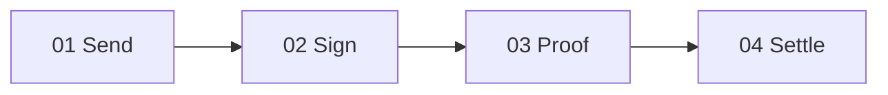

# Filosign Marketing Site Design Specification (`@filosign/astro`)

This document outlines the visual identity system, product positioning, content hierarchy, native data shapes, and design tokens of the **Filosign** marketing website (`apps/astro`), compiled directly from the codebase configurations, style sheets, and product briefs.

---

## 1. Product Purpose & Positioning

### Core Thesis
Filosign is **private agreement workflow software**. For internet-native teams and modern organizations, completed agreements can optionally trigger **non-custodial USDC payouts**. 

The design philosophy dictates that the product must look and feel like a standard Web2 corporate-grade e-signing platform. All cryptographic, wallet, and blockchain complexities are completely abstracted and hidden from view, visible only as secure proof receipts when requested.

### Messaging Hierarchy
1. **Primary Headline:** Encrypted, verifiable document workflows.
2. **First-Wedge Feature:** Signed agreement -> USDC payout.
3. **Core Pitch:** Private e-signing with instant stablecoin payouts. Secure, browser-encrypted document workflows for professional organizations.

### Visual Design Stance: Web2 Industry-Grade
* **No Web3/Crypto Visual Tropes:** The platform strictly avoids dark cyber themes, neon glows, blockchain network nodes, floating tokens, or futuristic gradients. 
* **Trust & Simplicity:** The aesthetics focus on presenting a clean, trust-inspiring, enterprise-grade interface. The app looks like a standard high-quality SaaS tool (e.g., DocuSign, Documenso, or Dropbox Sign).
* **Software Facade:** Frame all payout actions as simple contract terms and standard billing ledgers rather than decentralized tech experiments.

---

## 2. Visual Identity & Design Tokens

The site inherits a modern, clean, light-mode visual design with soft olive-greens, warm ambers, and clear, high-contrast dark text surfaces. 

### Spacing & Layout Tokens
Defined in [global.css](file:///Users/styles/Styles/Code/filosign/apps/astro/src/styles/global.css) and [marketing-layout.ts](file:///Users/styles/Styles/Code/filosign/apps/astro/src/lib/marketing-layout.ts):

* **Max Width:** `--container-marketing` / `max-w-marketing` = `90rem` (~1440px)
* **Gutter Padding (`px-page`):** `px-4` (mobile) $\rightarrow$ `sm:px-6` $\rightarrow$ `md:px-8` $\rightarrow$ `lg:px-10` (desktop)
* **Section / page vertical rhythm:** `py-12 md:py-20` (`marketingSectionYClass`)
* **Narrow content width (navbar-aligned):** `max-w-3xl` (`marketingNarrowWidthClass`)
* **Nav Sticky Offset:** `pt-[max(1rem,env(safe-area-inset-top))] sm:pt-6 md:pt-10`
* **Card Border Radius:** `var(--radius)` = `0.5rem`
  * `radius-sm`: `0.3rem` (calc 0.6)
  * `radius-md`: `0.4rem` (calc 0.8)
  * `radius-lg`: `0.5rem`
  * `radius-xl`: `0.7rem` (calc 1.4)
  * `radius-2xl`: `0.9rem` (calc 1.8)
  * `radius-3xl`: `1.1rem` (calc 2.2)

### Color Palette (OKLCH & HSL)
Surfaces and accents are set as standard design tokens to ensure consistency:

| Token | CSS Variable Value | Color Preview / Description |
|---|---|---|
| Background | `oklch(1 0 0)` | Clean white |
| Foreground | `oklch(0.141 0.005 285.823)` | Near-black/deep charcoal |
| Card | `oklch(0.97 0.001 286.375)` | Ultra-light gray-purple surface |
| Card Foreground | `oklch(0.141 0.005 285.823)` | Near-black |
| Border / Input | `oklch(0.92 0.004 286.32)` | Light gray divider |
| Primary | `oklch(0.21 0.006 285.885)` | Deep charcoal primary action |
| Primary Foreground | `oklch(0.985 0 0)` | Near-white |
| Secondary | `oklch(94% 0.097 130)` / `hsl(90, 56%, 71%)` | Bright lime/green accent |
| Muted Foreground | `oklch(0.552 0.016 285.938)` | Cool medium gray |
| Warning | `oklch(0.8426 0.1688 83.88)` | Amber alert yellow |
| Primary Light | `hsl(90, 67%, 83%)` | Soft pastel green |
| Primary Medium | `hsl(90, 50%, 38%)` | Deep leafy green |
| Primary Dark | `hsl(75, 67%, 13%)` | Dark olive |
| Secondary Light | `hsl(38, 100%, 83%)` | Soft pastel amber |
| Secondary Medium | `hsl(33, 67%, 62%)` | Medium orange-amber |
| Secondary Dark | `hsl(28, 58%, 37%)` | Deep brown-amber |

### Typography
Font weights and headings use modern variable-font scales:
* **Headers (h1, h2, h3, h4) & Buttons:** `font-inter` (`"Inter Variable", sans-serif`) with `font-medium`, `leading-tight`, `tracking-tight`.
* **Body, Paras, and Lists:** `font-manrope` (`"Manrope Variable", sans-serif`).
* **Text Selection:** Highlight color uses `var(--secondary)` with `var(--secondary-foreground)` text.

### Button Class Schemes
Defined in [marketing-button.ts](file:///Users/styles/Styles/Code/filosign/apps/astro/src/lib/marketing-button.ts):
* **Primary Large:** `min-h-11 h-12 px-8 bg-primary text-primary-foreground hover:bg-primary/90 rounded-lg text-base font-medium`
* **Ghost Large:** `min-h-11 h-12 px-8 border border-border text-foreground hover:bg-muted rounded-lg text-base font-medium`
* **Primary Medium:** `min-h-11 h-11 px-6 bg-primary text-primary-foreground hover:bg-primary/90 rounded-lg text-sm font-medium`
* **Nav CTA:** `bg-secondary text-secondary-foreground hover:bg-secondary/90 font-semibold min-w-28 text-sm`

---

## 3. Product Native Shape: The Timeline

Filosign's design does not follow a generic landing-page template. Instead, it is organized around the product's native workflow shape-a sequential agreement-to-settlement pipeline:

### Timeline Phases & Copies
Defined in [HowItWorksIsland.tsx](file:///Users/styles/Styles/Code/filosign/apps/astro/src/components/islands/HowItWorksIsland.tsx):

1. **Send the document** (`SendStepMock`)
   * *Copy:* "Upload an agreement, add recipients, and route it through an encrypted signing workflow."
2. **Collect signatures** (`SignStepMock`)
   * *Copy:* "Signers complete assigned fields while Filosign records who signed and what was completed."
3. **Export proof** (`ProofStepMock`)
   * *Copy:* "Generate an exportable proof packet. No stitching together emails and screenshots."
4. **Settle when needed** (`SettleStepMock`)
   * *Copy:* "Attach payout rules that execute after signing conditions are met."

---

## 4. Secure Payout & Compliance Architecture

The core feature of the app is the optional USDC stablecoin settlement. The user interface abstracts all blockchain details (gas fees, transaction hashes, smart-contract parameters), rendering them in a standard financial layout (e.g. as simple invoice payments and bank-style status receipts).

* **Payment Execution:** Handled via a secure, non-custodial smart contract layer. Senders register leg payout values and approve the validator. Payouts execute automatically once the document's signing requirements are satisfied.
* **Recipient Allowlist:** Recipients must be a designated document participant or the organization's verified payout wallet address.
* **Access Safeguards:** Payout registration in the UI is gated behind a manual screening feature flag for risk management.

---

## 5. Structured Content Map & Visual Assets

Every piece of text and asset is mapped directly from the codebase.

### Landing Sections & Mocks
1. **Hero Badge:** "Public beta" with a pulsing green circle.
2. **Hero Title:** "Private agreement workflows that can settle themselves"
3. **Hero Subhead:** "Send encrypted documents, collect verifiable signatures, and attach payouts on signing conditions."
4. **Main Demo Video:** `/media/demo.webm` (aspect ratio 2:1 / widescreen layout).
5. **Problem Section:**
   * *Title:* "Agreements, approvals, and payments are split across tools."
   * *Before vs After:*
     * *Before:* "document in one tool, approval in chat, payout in a wallet, evidence in a folder."
     * *After:* "encrypted agreement, verifiable signature record, proof packet, and attached payouts."
   * *Asset:* `/images/stock_14.webp` (Problem Architecture).
6. **Bento Features:**
   * **Verify anywhere:** "Take the signing record with you. Anyone can check that the agreement was signed, without logging into Filosign." (`ProofOutsideMock`)
   * **Private by default:** "Files are encrypted in your browser before upload. Only you and your signers can read them. We cannot." (`PrivateByDefaultMock`)
   * **You approve who can send:** "Senders need your permission before they can route documents to you. Fewer surprise requests in your inbox." (`RecipientControlMock`)
   * **Export a record anyone can read:** "Get a clear summary of who signed, when they signed, and which fields were completed, ready to share with finance, legal, or a grant reviewer." (`SignAndSettleMock`)
7. **Use Cases Grid:**
   * **Grant milestone approvals:** "Release funds when deliverables are signed and verified." (Asset: `/images/stock_2.webp`)
   * **Contractor forms and handovers:** "Close out work with proof you can export, not just email threads." (Asset: `/images/stock_5.webp`)
   * **Bounty and hackathon payouts:** "Collect signatures first, then settle attached payouts when conditions are met." (Asset: `/images/stock_6.webp`)
8. **Trust CTA Band:** Loops trust background video `/media/green-abstract-15sec-clip.webm`.

---

## 6. Pricing Plans & Entitlements

Subscriptions are processed by **Dodo Payments** acting as Merchant of Record (MoR). Free tier is temporarily hidden on the pricing comparison matrix.

### The Pricing Matrix
Tiers and features mapped from [pricing.astro](file:///Users/styles/Styles/Code/filosign/apps/astro/src/pages/pricing.astro) and [v1.ts](file:///Users/styles/Styles/Code/filosign/packages/entitlements/src/catalog/v1.ts):

| Plan | Pricing | Documents / Month | Signers / Doc | Unique Features Included |
|---|---|---|---|---|
| **Solo** (`individual`) | $20/mo (billed yearly) | 10 (account) | Max 3 | Browser encryption, full proof packet, optional 1y/3y archival storage, draft review links. |
| **Teams** (`teams`) | $35/user/mo (billed yearly) | 15 per user (pooled) | Max 5 | Everything in Solo, plus: shared templates, team envelope drafts, team envelope visibility, attached basic USDC payouts. |
| **Teams Pro** (`teams_pro`) | $59/user/mo (billed yearly) | 25 per user (pooled) | Max 10 | Everything in Teams, plus: custom integrations, seat allocation, bulk send from CSV, custom branding, webhooks, metadata tags, advanced routing, and advanced settlement rules. |
| **Enterprise** | Custom by request | Unlimited | Custom | SLA support terms, custom security reviews, procurement-friendly contracts. |

---

## 7. Motion & Animation System

Animations are implemented via Framer Motion / Motion.js and Animate On Scroll (AOS).

### Spring & Easing Presets
Imported from `@filosign/motion` tokens to ensure fluid, premium transitions:

* `SPRING_TOKENS.soft`: `stiffness: 200, damping: 25` (standard fades, delays, scroll transitions)
* `SPRING_TOKENS.snappy`: `stiffness: 400, damping: 28, mass: 0.8` (price value change toggles)
* `SPRING_TOKENS.bouncy`: `stiffness: 345, damping: 20`
* `SPRING_TOKENS.smooth`: `stiffness: 230, damping: 25`
* `SPRING_TOKENS.glide`: `stiffness: 180, damping: 28`
* `TWEEN_TOKENS.normal`: `duration: 0.2, ease: "easeInOut"`
* `TWEEN_TOKENS.fast`: `duration: 0.12, ease: "easeInOut"`

### AOS Parameters
Initialized globally in BaseLayout for simple scroll transitions:
* **Duration:** 800ms
* **Easing:** `ease-out-cubic`

---

## Copy punctuation

User-facing copy in `apps/astro` and `apps/client` avoids em dashes (U+2014).

- **Page titles:** hyphen-minus separator, e.g. `About - Filosign`
- **Empty UI cells:** en dash (`–`) as a null placeholder
- **Prose:** prefer comma, period, colon, or parentheses over dramatic pauses
- **List labels:** `**Label:** clause`, not bold-label dash clause
- **Before shipping blog posts:** read aloud; split run-on claim/explanation pairs if a comma feels weak