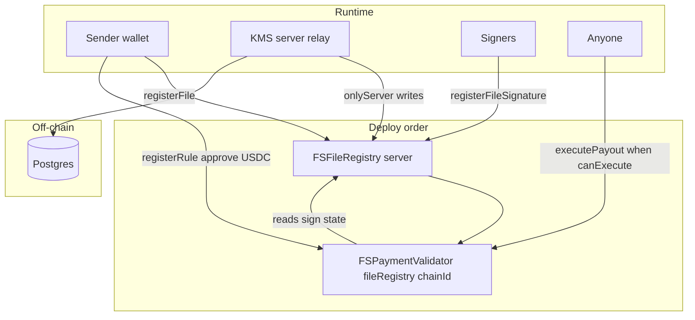

# Filosign contracts — architecture (immutable v1)

Frozen **immutable bytecode** for mainnet: two production contracts. No UUPS proxies. Identity, keygen, and sharing approvals live **off-chain** (Postgres + server).

## Roles

| Actor | Key | Role |
| ----- | --- | ---- |
| **Ledger** | `FC_PVT_KEY` | Deploys `FSFileRegistry` and `FSPaymentValidator` |
| **KMS / relayer** | `FC_SERVER_ADDRESS` → `FSFileRegistry.server` | `onlyServer` relay for `registerFile` / `registerFileSignature` |

`server` is **immutable** at deploy. Rotating the relayer requires a new v1 bundle on a new chain or a future contract version.

## Topology



1. **`FSFileRegistry(server)`** — permanent auditable send + sign trail (EIP-712, email commitments).
2. **`FSPaymentValidator(fileRegistry, chainId)`** — permissionless USDC settlement on sign; no custody.

## Trust boundaries

- **Permanent sign record:** `FSFileRegistry` address at mainnet deploy is canonical for envelopes registered there.
- **E2EE / identity:** wallet registration, KEM material, and sender–recipient sharing are server-side; decrypt uses DB wraps + derived keys, not chain reads.
- **No Filosign custody:** validator only `transferFrom(payer, recipient)`; contract must not hold USDC.
- **Permissionless payout:** any address may call `executePayout` when `canExecute` is true (server relay is UX).
- **Payer-only rules:** `registerRule` requires `msg.sender == payer`.

## Security practices (pre-mainnet)

- Run `bun run --cwd apps/contracts test` (required before migrate).
- Run `slither .` from `apps/contracts` (see [TESTING.md](./TESTING.md)).
- USDC is **6 decimals** on Base; never assume `1e18` in app or contract math.
- `FSPaymentValidator` uses OpenZeppelin `SafeERC20` and `ReentrancyGuard`.

## Future contract changes

See [`project/contracts-future-scope.md`](../../project/contracts-future-scope.md).

## Deploy

```bash
# Env: FC_PVT_KEY (Ledger), FC_SERVER_ADDRESS (KMS)
bun run --cwd apps/contracts migrate:testnet   # test + deploy Base Sepolia
bun run --cwd apps/contracts migrate:mainnet   # test + deploy Base
```

Local deploy: `server` = `FC_SERVER_ADDRESS` (else Hardhat #1); deploy funds that address with 100 ETH.
