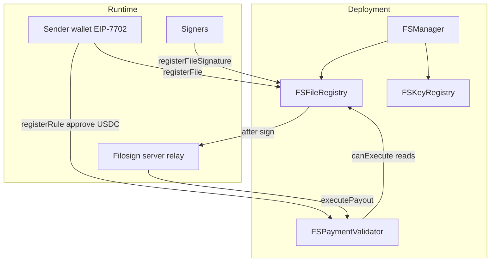

# `@filosign/contracts`

Solidity contracts for Filosign: document registration and signing (`FSFileRegistry`), cryptographic registration (`FSKeyRegistry`), privileged orchestration (`FSManager`), and pull-based USDC payouts (`FSPaymentValidator`). Hardhat-only `MockUSDCToken` supports local testing.

## Contents

| Section | Audience |
| -------- | -------- |
| [Architecture](#architecture) | Everyone |
| [Contract roles](#contract-roles) | Engineers and agents |
| [Payment flow](#payment-flow) | Product and backends |
| [Trust model](#trust-model) | Security |
| [Repository layout](#repository-layout) | Maintainers |
| [Testing](#testing) | Engineers |

## Architecture

`FSManager` deploys `FSFileRegistry` and `FSKeyRegistry` in its constructor. `FSPaymentValidator` is deployed separately and wired to the file registry address.



- **Document state** (who signed, commitments, placement) lives in `FSFileRegistry`.
- **Keys and approvals** live in `FSKeyRegistry` and `FSManager`.
- **Payments** are not custodied by Filosign. The sender approves `FSPaymentValidator` for an exact USDC amount per rule; when release conditions hold, `executePayout` performs `transferFrom` (callable by anyone, including the Filosign server relay or user wallets).

## Contract roles

| Contract | Role |
| -------- | ---- |
| `FSManager` | Server-gated admin: pause flags, `approveSender`, fee configuration, registry pointers. |
| `FSFileRegistry` | File registration, signatures, viewer/signer commitments, `allSigned`, `FileSigned` events. |
| `FSKeyRegistry` | Wallet keygen registration and Dilithium/KEM material. |
| `FSPaymentValidator` | Settlement rules per `cidId`: `registerRule` (payer only), `canExecute`, `executePayout` (permissionless when conditions met). |
| `MockUSDCToken` | Local Hardhat USDC stand-in. |

### FSPaymentValidator release types

| Enum | Meaning |
| ---- | ------- |
| `AllSigned` | Payout when every required signer has signed. |
| `SpecificSigner` | Payout when a signer matching an email commitment signs. |
| `AtLeastN` | Payout when at least N **distinct** signers from a commitment set have signed (duplicates and zero commitments rejected at `registerRule`). |

## Payment flow

1. **Send (client):** For each payment line, the sender’s wallet calls `USDC.approve(validator, amount)` then `registerRule(...)` on `FSPaymentValidator`, then `registerFile` on the registry via the server relay path.
2. **Sign:** Recipients sign; the registry emits `FileSigned` per signature.
3. **Execute (server / user):** After signatures, the Filosign server relay (or sender/recipient via the app) calls `executePayout(ruleId)` when `canExecute` is true.
4. **Index (server):** `file_settlement_rules` rows track status from relay results and `settlements.confirmSettlement`.

Filosign never holds USDC. Payout txs are permissionless `executePayout` calls; the server relay only pays gas.

### Cancelling a payout before execution

There is no `cancelRule` on-chain. The payer controls funding:

1. **Revoke allowance** — `USDC.approve(FSPaymentValidator, 0)` from the payer wallet (exposed in the sign UI for senders). `executePayout` will revert on `transferFrom` even when release conditions are met.
2. **Leave rule unfunded** — skip or revoke approval before signers finish.

The rule row remains on-chain and in `file_settlement_rules` until executed or marked failed. **Filosign does not control or screen all on-chain payouts** — see marketing Terms of Service.

### Indexing (supported path)

Server `files.register` verifies each settlement rule on-chain (`assertSettlementRulesVerifiedOnChain`) before inserting into `file_settlement_rules`. Rules created only outside the app are not indexed.

See [`apps/server/README.md`](../server/README.md) for auto-execution cron and [`project/settlements/architecture-and-non-custody.md`](../../project/settlements/architecture-and-non-custody.md).

## Trust model

- **Server (`onlyServer` on manager paths):** Can register files and signatures on behalf of users who have authenticated; cannot move USDC without the payer’s on-chain approve.
- **Relayers:** Any address may call `executePayout` once `canExecute` is true; Filosign server relay and users provide the primary paths.
- **Payer:** Must call `registerRule` as `msg.sender == payer`; approval is exact-amount per rule.
- **Recipients (product):** Filosign UI only allows envelope participants or a linked organization payout wallet.

## Repository layout

| Path | Role |
| ---- | ---- |
| `src/*.sol` | Contract source |
| `test/*.spec.ts` | Hardhat + viem tests |
| `scripts/deploy.ts` | Deploy and write `definitions/` |
| `definitions/` | Generated addresses and ABIs (do not hand-edit) |
| `services/contracts.ts` | `getContracts()` for server and SDK |

## Testing

```bash
bun run --cwd apps/contracts test
bun run --cwd apps/contracts check-types
```

`FSPaymentValidator.spec.ts` covers register, approve, execute, and release-type gating. See [TESTING.md](./TESTING.md).

Deploy with migrate (runs tests first):

```bash
bun run contracts -- --migrate
```

