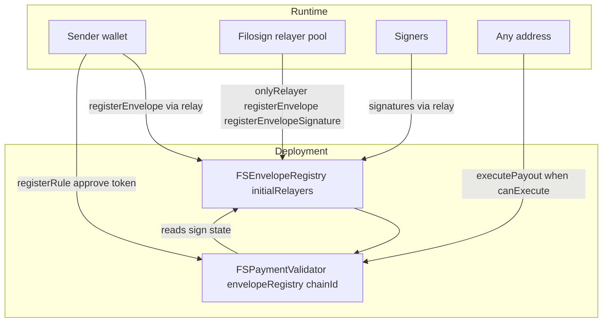

# `@filosign/contracts`

Solidity contracts for Filosign: document registration and signing (`FSEnvelopeRegistry`) and pull-based settlement (`FSPaymentValidator`). Hardhat mocks (`MockUSDCToken`, `MockFeeOnTransferToken`, `MockERC1271Signer`) support local testing only.

Wallet identity, keygen, and sharing approvals are **server-side** - not on-chain.

## Contents

| Section | Audience |
| -------- | -------- |
| [Architecture](#architecture) | Everyone |
| [Capacity limits](#capacity-limits) | Engineers and product |
| [FSEnvelopeRegistry](#fsenveloperegistry) | Engineers |
| [FSPaymentValidator](#fspaymentvalidator) | Product and backends |
| [Payment flow](#payment-flow) | Product and backends |
| [Trust model](#trust-model) | Security |
| [Static analysis (Slither)](#static-analysis-slither) | Security / pre-mainnet |
| [Repository layout](#repository-layout) | Maintainers |
| [Testing](#testing) | Engineers |

## Architecture

**Immutable v1:** deploy `FSEnvelopeRegistry(initialRelayers[])` then `FSPaymentValidator(envelopeRegistry, chainId)` and `FSAttachmentRelease(envelopeRegistry, chainId)`. No proxies. EIP-712 domain version **"4"** on the registry (`RegisterEnvelope` includes `orgIdCommitment`, not treasury wallet).

See [ARCHITECTURE.md](./ARCHITECTURE.md) and [`project/contracts-future-scope.md`](../../project/contracts-future-scope.md).



- **Document state** (required/optional signers, routing, quorum, signatures, amendments) lives in `FSEnvelopeRegistry`.
- **Payments** are not custodied by Filosign. The payer approves `FSPaymentValidator` for a rule total; when release conditions hold, `executePayout` performs `transferFrom(payer, recipient)` per leg (callable by anyone).
- **Product target:** USDC on Base. The validator accepts any ERC20 at `registerRule` today; the app wires USDC only. An on-chain token allowlist is deferred (see future scope).

## Capacity limits

Bytecode constants - not product tier limits. Entitlements + server enforce stricter caps per plan.

| Constant | Value | Applies to |
| -------- | ----: | ---------- |
| `MAX_SIGNERS_PER_ENVELOPE` | **128** | Required signers; `routingOrder`; `quorumSet` |
| `MAX_ORG_CONTROLLERS` | **64** | Wallets per `orgIdCommitment` in `setOrgControllers` |
| `MAX_VIEWERS_PER_FILE` | **128** | Viewer roster at register |
| `MAX_RULE_COMMITMENTS` | **128** | Payer commitment lists on rules (`AtLeastN`, `QuorumSet`, `AllOfSet`, …) |
| `MAX_PAYOUT_LEGS` | **32** | `PayoutLeg[]` per rule |

## FSEnvelopeRegistry

Permanent on-chain send + sign trail. Writes are **`onlyRelayer`** (authorized pool wallets); owner can add/remove relayers via `Ownable2Step`.

### RegisterEnvelope (EIP-712 v4)

Sender-signed at send. Stored per file:

- **`orgIdCommitment`** - team org UUID hash, or zero for personal sends
- **Required** signer commitments only (optional roster rejected at register)
- **Routing:** `Parallel` (default) or `Sequential`; `routingOrderHash` on-chain; pass `routingOrder` calldata on sign/amend (hash verified)
- **Quorum:** `quorumN` + `quorumSetHash`; pass `quorumSet` calldata on sign/amend when needed
- Existing: placement, viewer commitments, per-signer signature blobs, packed counters, `completedAt` / void tombstones

### Completion views

| View | Meaning |
| ---- | ------- |
| `isEnvelopeComplete(cid)` | `completedAt != 0` - sole envelope completion source of truth |
| `isRevokedBeforeComplete(cid)` | `revokedBeforeCompletedAt != 0` - void tombstone |
| `rosterSignedCount(cid)` | Signers who have posted signature bytes (rule-level releases) |
| `rosterSignedCount(cid)` | Signed count across full roster |
| `hasSigned(cid, commitment)` | Single signer signed |

### Other registry APIs

- **`registerEnvelopeSignature`** - sequential order enforced when configured; verifies routing/quorum calldata against stored hashes; increments required counters; may set `completedAt` via `_markCompleteIfNeeded`
- **`proposeSignerReplacement`** - instant apply when nobody signed; otherwise pending + freeze until **`executeSignerReplacement`** (clears all signatures) or **`cancelSignerReplacement`**
- **`recallEnvelope`** - void before complete; recaller = sender or `isOrgController(orgIdCommitment, recaller)`; emits `EnvelopeRevokedBeforeComplete`
- **`setOrgControllers` / `getOrgControllers` / `isOrgController`** - server-synced owner+admin set per org; emits **`OrgControllersSet`** (full replace - index as authoritative snapshot)
- **`validateEnvelopeAckSignature`** - viewer/signer ack validation (off-chain consent; not used for payout release)
- **ERC-1271** - Safe-compatible wallets via `FSSignatureValidation`

**Treasury vs controllers:** payout wallet (`organizations.orgWalletAddress`) is off-chain only. Controllers govern void/amend/attachment; they do not replace the treasury as settlement payer unless product routes payouts through that wallet separately.

Signature validity: timestamps must be within **`SIGNATURE_CLOCK_DRIFT_TOLERANCE` (5 minutes)** of `block.timestamp` (`SignatureFuture` if too far ahead) and **`SIGNATURE_VALIDITY_PERIOD` (24 hours)** after the signed timestamp (`SignatureExpired` if too late). Effective acceptance window: roughly `[timestamp, timestamp + 24 hours]`, with `timestamp` not more than 5 minutes ahead of chain time.

## FSPaymentValidator

Document-linked settlement rules. **`registerRule` requires the file to exist** on the registry (`FileNotRegistered` otherwise).

### Rule shape

One rule = one `ruleId` = shared token + release type + optional expiry, with **multiple payout legs**:

```solidity
struct PayoutLeg { address recipient; uint256 amount; }
```

- One **`approve`** for the sum of leg amounts
- **`executePayout(ruleId)`** - atomic multi-leg transfer; balance-delta check per leg (`InsufficientTransferReceived` on fee-on-transfer tokens)
- **`expiresAt`** - `0` = none; else must be in the future at register/update and blocks execute after deadline

### Release types

| Enum | On-chain condition |
| ---- | ------------------ |
| `AllSigned` / `AllRequiredSigned` / `AllSignedComplete` | `isEnvelopeComplete(cid)` |
| `SpecificSigner` | `hasSigned(cid, commitment)` |
| `AtLeastN` | ≥ N distinct signers from payer-supplied commitment list |
| `QuorumRequired` | `isEnvelopeComplete(cid)` when file has `quorumN`; else ≥ `thresholdN` required signers signed |
| `QuorumSet` | ≥ N signed from payer-supplied commitment list |
| `QuorumAll` | ≥ N signed from **full roster** (`rosterSignedCount`) |
| `AllOfSet` | Every commitment in payer list signed |

Teams/basic app flows use `AllSigned`, `SpecificSigner`, and `AtLeastN`. Advanced types are on-chain for Teams Pro; server entitlements gate who may register them.

### Rule CRUD (payer-only, before execute)

| Op | Function | Notes |
| -- | -------- | ----- |
| Create | `registerRule` | `msg.sender == payer`; file must be registered; max **128** rules per `cidId` |
| Update | `updatePayoutRule` | Payer; `requiredSignaturesCount == 0`; `!executed && !cancelled`; `legPaidBitmap == 0`; sum(new legs) ≤ current allowance |
| Cancel | `cancelPayoutRule` | Same signing lock as update; sets `cancelled` |
| Execute | `executePayout` / `executePayoutLeg` | Anyone when `canExecute`; `nonReentrant` |

After the first required signature, update and cancel revert until **`clearEnvelopeSignatures`** (registry) clears on-chain progress, or the sender/org controller **`recallEnvelope`** (void). Paid legs block clear and signer swap (`hasAnyPaidLegForCid`).

Revoking **`approve(validator, 0)`** off-chain also blocks execution even if the rule is active.

### Security primitives

- OpenZeppelin **`SafeERC20`** and **`ReentrancyGuard`**
- **Chain-id pin** in constructor (`deploymentChainId`)
- Custom errors throughout (no string reverts)

## Payment flow

1. **Register file (client → server relay):** `registerEnvelope` on `FSEnvelopeRegistry` with routing/quorum calldata per tier.
2. **Attach settlement (client):** Payer `approve(validator, totalAmount)` then `registerRule(...)` on `FSPaymentValidator` (legs, release type, optional `expiresAt`). Server indexes via `settlements.registerForFile` after on-chain verification.
3. **Sign:** Recipients sign; registry emits `FileSigned` per signature.
4. **Execute (server / user):** When `canExecute(ruleId)`, anyone calls `executePayout` (Filosign relay or wallet in app).
5. **Index (server):** `file_settlement_rules` tracks status from relay results and `settlements.confirmSettlement`; daily cron syncs off-platform `executed` state.

Filosign never holds funds. Payout txs are permissionless; the server relay only pays gas.

### Cancelling before execution

1. **`cancelPayoutRule(ruleId)`** - payer-only; sets `cancelled` on-chain.
2. **Revoke allowance** - `token.approve(FSPaymentValidator, 0)` from the payer wallet. `executePayout` reverts on `transferFrom` even when release conditions are met.

Pair both in product UX for clarity. The rule row may remain on-chain and in Postgres until marked executed or failed.

### Indexing (supported path)

After the payer registers rules on-chain (`registerRule` + `approve`), the server indexes them via **`settlements.registerForFile`**, verifying on-chain state with `assertSettlementRulesVerifiedOnChain` before inserting into `file_settlement_rules`. `files.register` does not write settlement rows. Rules created only outside the app are not indexed.

See [`apps/server/README.md`](../server/README.md) and [`project/settlements/architecture-and-non-custody.md`](../../project/settlements/architecture-and-non-custody.md).

## FSAttachmentRelease

Supplementary packet rules (Teams Pro). **`registerAttachmentRule`**, **`updateAttachmentRule`**, and **`cancelAttachmentRule`** allow the envelope **sender** or an **`isOrgController`** for the file’s `orgIdCommitment`. Update and cancel require `requiredSignaturesCount == 0` (same escape hatches as payout rules). Reverts: `UnauthorizedRuleRegistration`, `EnvelopeRecalled`, `FileNotRegistered`, `RequiredSigningStarted`.

## Registry satellite wiring

After deploy, **`setSatelliteContracts(paymentValidator, attachmentRelease)`** on `FSEnvelopeRegistry` is **write-once** (owner-only, non-zero addresses). The deploy script calls it immediately after satellite deploy. The registry invokes **`remapSignerCommitment`** on both satellites at the end of signer substitution, and **`hasAnyPaidLegForCid`** before **`clearEnvelopeSignatures`** / **`executeSignerReplacement`** when the validator is configured.

### Registry destructive actions

| Action | Auth | Effect |
| ------ | ---- | ------ |
| `recallEnvelope` | Sender or org controller (EIP-712) | Void envelope; terminal |
| `clearEnvelopeSignatures` | Same | Clears signatures and bound wallets; reopens satellite update/cancel; signers must re-ack/sign |

## Trust model

- **Relayer pool (`onlyRelayer` on registry):** Relays authenticated users’ register/sign/void/amend txs; syncs `setOrgControllers` from Postgres owner+admins; cannot move tokens without the payer’s on-chain `approve`.
- **Owner (contract governance):** Adds/removes registry relayers and transfers ownership (2-step). Does not grant access to user settlement funds.
- **Org controllers (product governance):** Owner/admin wallets on the registry mapping may void/amend and manage attachment rules for that org’s envelopes.
- **Relayers:** Any address may call `executePayout` once `canExecute` is true.
- **Payer:** Must call `registerRule` / `updatePayoutRule` / `cancelPayoutRule` as `msg.sender == payer`; chooses token, recipients, and release params.
- **Recipients (product):** Filosign UI restricts envelope participants or org payout wallets; chain allows arbitrary leg recipients by payer choice.

Release conditions are **verifiable on-chain** so execute stays permissionless - the server facilitates relay/UX only.

## Static analysis (Slither)

Recommended before mainnet (see [TESTING.md](./TESTING.md)):

```bash
bun run compile && slither . --exclude-dependencies
```

### Expected finding: `arbitrary-send-erc20`

Slither flags `executePayout` because it uses:

```solidity
IERC20(rule.token).safeTransferFrom(rule.payer, leg.recipient, leg.amount);
```

where **`from != msg.sender`**.

**This is intentional.** Filosign uses a **pull-payment validator** model:

- The **payer** creates the rule (`msg.sender == payer`) and **`approve`s** the validator.
- **`from` is not a free parameter at execute time** - it is always the stored `rule.payer`.
- **Anyone** may execute when sign conditions are met (permissionless settlement / gas sponsorship).

Slither’s generic exploit assumes a function lets callers pass an arbitrary `from` and drain any approver. That does not apply here: only pre-registered rules pull from the payer who opted in.

**Industry resolution:** accept the pattern, document it (this section), and triage in audit/CI - do **not** switch to `transferFrom(msg.sender, …)`, which would break permissionless execute.

Optional hardening (product, not a Slither fix): **immutable USDC allowlist** at `registerRule` for v1 mainnet - deferred; see future scope.

### Org controller governance (Slither triage)

- **`setOrgControllers` is `onlyRelayer`** - same trust model as other relay writes; duplicate-wallet and max-64 guards are on-chain validation only.
- **`getOrgControllers`** - read-only; no state change.
- **`FSAttachmentRelease`** - `UnauthorizedRuleRegistration` vs `UnauthorizedRuleCancellation` split for explorer clarity; ACL unchanged.

### Informational noise (safe to ignore)

- **Cyclomatic complexity** on `amendSigner` / `_validateRegisterRouting` / `setOrgControllers` - complex validation, no known exploit.
- **Uninitialized local** on `uint8 signed` / loop flags - Solidity defaults to zero; Slither false positive.

Triage real high/medium findings: reentrancy (mitigated by `nonReentrant` + CEI), unchecked returns (mitigated by `SafeERC20`), unprotected privileged functions.

## Repository layout

This package is **public OSS**: Solidity source, Hardhat compile/test, and exported `abis/` + `chains/` for verify consumers.

Deploy, private definitions, and `getContracts()` live in the private monorepo package **`packages/evm`** (`@filosign/evm`). From the Filosign repo root, use `bun run contracts --`.

| Path | Role |
| ---- | ---- |
| `src/FSEnvelopeRegistry.sol` | Registry (EIP-712 v4, org controllers) |
| `src/FSAttachmentRelease.sol` | Supplementary attachment release |
| `src/FSPaymentValidator.sol` | Settlement validator |
| `src/libraries/*.sol` | Commitment, routing, signature helpers |
| `src/errors/*.sol` | Custom errors |
| `src/Mock*.sol` | Hardhat test doubles only |
| `test/*.spec.ts` | Hardhat + viem tests (~110 cases) |
| `test/fixtures.ts` | Deploy helpers, EIP-712 register/sign flows |
| `scripts/interfaces.ts` | Generate `src/interfaces/IFS*.sol` from implementations |
| `abis/` | Public ABI JSON (written by `packages/evm` `export:public`) |
| `chains/manifest.json` | Public chain address manifest (same export) |
| `ARCHITECTURE.md` | Roles, deploy order, owner runbook |
| `TESTING.md` | Test conventions and Slither |

## Testing

From the Filosign repo root:

```bash
bun run contracts -- test        # OSS Hardhat
bun run --cwd oss/packages/contracts check-types
```

From this package only (OSS subtree):

```bash
bun run test                     # compile + hardhat test
```

Coverage includes: registry routing/quorum/amend/bounds, all validator release types, multi-leg atomic execute (32 legs), expiry, fee-on-transfer revert, payer CRUD, ERC-1271 paths, allowance failure leaving `executed` false.

See [TESTING.md](./TESTING.md).

### Deploy env

Env files: `packages/evm/.env.local` | `.env.staging` | `.env.production`. Keys: `FC_DEPLOYER_PRIVATE_KEY`, `RELAYER_POOL`, optional `FC_OWNER_ADDRESS`, `ALCHEMY_API_KEY`, `ETHERSCAN_API_KEY`. See [`packages/evm/README.md`](../../../packages/evm/README.md).

### Migrate

From the Filosign repo root (`bun run contracts --`):

```bash
bun run contracts -- --migrate --local      # compile + deploy Hardhat (no test gate)
bun run contracts -- --migrate --testnet    # test + deploy Base Sepolia
bun run contracts -- --migrate --mainnet    # test + deploy Base
```

Pre-mainnet: green tests + `check-types` + `slither .` triage + verify `owner()`, `server()`, and contract addresses on Base scan after deploy.
