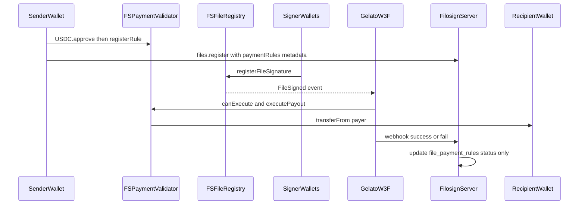

# `@filosign/gelato` — USDC payouts (non-custodial)

Reference for Filosign’s optional **pull-payment** stack: on-chain rules in [`FSPaymentValidator`](../../apps/contracts/src/FSPaymentValidator.sol), release truth in [`FSFileRegistry`](../../apps/contracts/src/FSFileRegistry.sol), and **Gelato Web3 Functions** that relay `executePayout` when conditions are met. This package does not hold funds, sign user transactions, or gate who may execute payouts on-chain.

For compliance-oriented summaries, see also [`project/payments/architecture-and-non-custody.md`](../../project/payments/architecture-and-non-custody.md), [`recipient-allowlist-policy.md`](../../project/payments/recipient-allowlist-policy.md), and public [Terms of Service](https://filosign.com/terms) / [Privacy Policy](https://filosign.com/privacy) (paths on the marketing site).

**Filosign does not control or screen, and hence is not responsible for, all on-chain payouts.** Gelato may relay `executePayout` for any on-chain rule when conditions are met; Filosign DB/UI index rules submitted through the app after on-chain verification at `files.register`.

---

## Executive summary

| Principle | What it means |
| --------- | ------------- |
| **Non-custodial** | USDC stays in the payer’s wallet until `executePayout` runs. Filosign has no hot wallet, pooled balance, or server-side `approve` / `transfer`. |
| **Pull payment** | The payer registers a rule and `approve`s the validator for an **exact** amount per rule. Settlement is `transferFrom(payer → recipient)` only when release conditions hold. |
| **Release on-chain** | Payouts are gated by registry signature state (`allSigned`, `hasSigned`, threshold counts). Paying gas does not bypass unsigned documents. |
| **Permissionless execution** | `executePayout` is callable by **any** address when `canExecute` is true (Gelato, payer, recipient, or a third party). There is no Filosign or `gelatoExecutor` admin gate on the contract. |
| **Gelato is optional** | Web3 Functions automate gasless relay via Gelato 1Balance. If Gelato is down, anyone can still call `executePayout` directly. |
| **Server is indexing + UX** | The API stores rule metadata, enforces product allowlists at file registration, and mirrors status from webhooks. It does **not** move money. |

Filosign is **signing software**. Optional USDC payouts are a separate, user-initiated on-chain flow the sender configures from their own wallet.

---

## End-to-end flow



### Step-by-step

1. **Send (client + React SDK)**  
   When the sender attaches payment lines to an envelope, [`registerPaymentRulesOnChain`](../../packages/react-sdk/src/lib/payment-rules.ts) runs in the browser/smart account:
   - `approve(token, validator, amount)` on the USDC (or MockUSDC locally) contract
   - `registerRule(...)` on `FSPaymentValidator` (caller must be the payer)  
   [`useSendFile`](../../packages/react-sdk/src/hooks/files/useSendFile.ts) then includes rule ids and tx hashes in the file registration payload.

2. **Register file (server relay)**  
   [`files.register`](../../apps/server/api/handlers/files/register.ts) relays `registerFile` on `FSFileRegistry` (server signs as relay, not as payer). For payments it only:
   - Inserts rows in `file_payment_rules` via [`insertPaymentRulesForFile`](../../apps/server/lib/domains/payments/insert-rules.ts)
   - Enforces [`assertPaymentRecipientsAllowlisted`](../../apps/server/lib/domains/payments/recipient-allowlist.ts) (signer, viewer, or org payout wallet)

3. **Signing**  
   Signers complete on-chain signatures on the registry. Each signature can emit `FileSigned`, which the event Web3 Function watches.

4. **Execution (Gelato, optional)**  
   A Web3 Function loads `ruleIdsForCid`, checks `canExecute(ruleId)`, and runs [`payerCanFundPayout`](src/lib/payout-preflight.ts) (balance + allowance). If both pass, it returns calldata for `executePayout(ruleId)`.

5. **Settlement (chain)**  
   The validator marks the rule executed and `safeTransferFrom`s USDC from payer to recipient. Reverts if conditions are not met, already executed, or `transferFrom` fails.

6. **Status sync (server)**  
   Gelato `onSuccess` / `onFail` POST to Filosign ([`applyGelatoPayoutWebhook`](../../apps/server/lib/domains/payments/gelato-webhook.ts)). Separately, hourly cron [`runSyncPaymentRulesJob`](../../apps/server/lib/domains/payments/sync-readiness.ts) promotes `pending` → `ready` when on-chain `canExecute` and funding checks pass (for the redrive cron).

---

## Who does what

| Actor | Role | Touches user USDC? | Can force payout without conditions? |
| ----- | ---- | ------------------ | ------------------------------------ |
| **Sender wallet** | `registerRule`, `approve` validator | Own wallet only | No — must wait for release + balance/allowance |
| **FSPaymentValidator** | Stores rules; conditional `transferFrom` | Never holds a balance | No — reverts if not executable |
| **FSFileRegistry** | Signature / release source of truth | No | No |
| **Gelato W3F** | Submits `executePayout` tx (gas from 1Balance) | No | No — only if `canExecute` + preflight pass |
| **Filosign server** | DB index, allowlist at register, webhooks, cron | **No** | **No** — does not sign payout txs |
| **Recipient** | Receives USDC on success | Receives only | No |
| **Anyone else** | May call `executePayout` directly | No | Same as Gelato — contract enforces rules |

### Filosign server does **not**

- Hold, pool, or transmit USDC
- Sign `approve`, `registerRule`, or `executePayout` on behalf of users
- Operate a dedicated payout executor key or on-chain allowlist for relayers (removed; execution is permissionless)
- Block or approve on-chain execution after a rule is registered

### Filosign server **does**

- Store payment rule metadata (`file_payment_rules`) for UI and compliance PDFs (bundle v3)
- Validate recipients on the **product path** at `files.register` (`signer` | `viewer` | `org_wallet`)
- Expose Gelato integration routes under `/api/integrations/gelato` (webhook secret only, no user JWT)
- Mirror on-chain outcome into statuses (`pending`, `ready`, `executed`, `failed_*`)
- Expose oRPC `payments.listByFile` and `payments.requestRetry` (sender retry for failed rules only)

### Product allowlist vs on-chain

On the supported app path, recipients must be an envelope participant or the organization’s linked payout wallet (`organizations.orgWalletAddress`). A payer can still call `registerRule` **directly on-chain** to any address; that is the payer’s wallet interaction outside Filosign software. See [`recipient-allowlist-policy.md`](../../project/payments/recipient-allowlist-policy.md).

---

## On-chain model (`FSPaymentValidator`)

Contract: [`apps/contracts/src/FSPaymentValidator.sol`](../../apps/contracts/src/FSPaymentValidator.sol). Deployed beside `FSManager` / registries; wired to the file registry address at deploy.

### Pull payment mechanics

- Each rule records `payer`, `recipient`, `token`, `amount`, `cidId`, and a **release type**.
- The payer must be `msg.sender` on `registerRule`.
- Before payout, the payer must have approved the validator for at least `amount` on the token contract.
- `executePayout` uses OpenZeppelin `safeTransferFrom(payer, recipient, amount)` — funds move straight from payer to recipient; the validator is not a custodian.

### Release types

| Enum | On-chain check |
| ---- | -------------- |
| `AllSigned` | `fileRegistry.allSigned(cidId)` |
| `SpecificSigner` | `fileRegistry.hasSigned(cidId, specificSignerCommitment)` |
| `AtLeastN` | At least `thresholdN` commitments from the rule’s signer list have signed |

`canExecute(ruleId)` and `executePayout(ruleId)` share the same `_releaseConditionsMet` logic. Already-executed rules or zeroed rules return false / revert.

### Permissionless `executePayout`

```solidity
/// Callable by anyone (Gelato or self-relay).
function executePayout(uint256 ruleId) external nonReentrant
```

There is **no** Filosign-controlled relayer role on the contract. Gelato is convenience infrastructure, not a trust gate for settlement.

### Indexing helpers

- `ruleIdsForCid(bytes32)` — rules attached to a document `cidId`
- `rules(uint256)` — full rule struct (public mapping)
- `signerCommitments(uint256)` — for `AtLeastN` rules

ABIs for integrators come from deployed definitions via `@filosign/contracts` (`getContractAbi`, `getContracts`). This package uses [`src/lib/contract-abis.ts`](src/lib/contract-abis.ts) (ethers `ContractInterface` cast from the same source).

---

## This package (`@filosign/gelato`)

Gelato **Web3 Functions** (W3F) watch chain state and optionally submit `executePayout`. Filosign’s server never submits these transactions.

### Package exports

| Import | Source | Trigger |
| ------ | ------ | ------- |
| `@filosign/gelato/payout` | [`src/payout-web3-function/index.ts`](src/payout-web3-function/index.ts) | `FileSigned` on `FSFileRegistry` |
| `@filosign/gelato/payout-redrive` | [`src/payout-redrive-cron/index.ts`](src/payout-redrive-cron/index.ts) | Gelato cron (recommended hourly) |

### Event function (`payout-web3-function`)

1. User args: `validatorAddress`, `registryAddress`, webhook URL/secret.
2. On `FileSigned`, read `cidId` from log topic 1.
3. `ruleIdsForCid(cidId)` on the validator.
4. For each rule: `canExecute(ruleId)` and `payerCanFundPayout`.
5. On first match: store `pendingOnChainRuleId` / `pendingCidId` in Gelato storage; return `callData` for `executePayout(ruleId)` to the validator.
6. [`registerPayoutWebhooks`](src/lib/webhook.ts): `onSuccess` / `onFail` POST JSON to Filosign (`kind`, `transactionHash`, `reason`, `onChainRuleId`, `cidId`).

If no rule is executable (conditions, balance, allowance, or already paid), returns `canExec: false` with a diagnostic message.

### Redrive cron (`payout-redrive-cron`)

Covers missed events, races, or rules that became executable after the last `FileSigned`:

1. `GET` `filosignPendingRulesUrl` with `X-Gelato-Webhook-Secret` (rules with DB status **`ready`**).
2. Same `canExecute` + preflight loop as the event function.
3. Same webhook callbacks.

The Filosign server cron (`sync-payment-rules`, hourly) only moves **`pending` → `ready`** when on-chain checks pass. It does **not** auto-retry `failed_*`; the sender uses `payments.requestRetry` after fixing allowance or balance.

### Shared libraries

| Module | Purpose |
| ------ | ------- |
| [`contract-abis.ts`](src/lib/contract-abis.ts) | `FSPaymentValidator`, `FSFileRegistry`, ERC-20 (MockUSDC artifact) ABIs from `@filosign/contracts` definitions |
| [`payout-preflight.ts`](src/lib/payout-preflight.ts) | Skip relay when payer lacks token balance or validator allowance |
| [`webhook.ts`](src/lib/webhook.ts) | Filosign callback payload and Gelato storage helpers |

---

## Filosign server integration

Router: [`apps/server/api/integrations/gelato.ts`](../../apps/server/api/integrations/gelato.ts). Mounted on the API **before** user JWT / oRPC (integration-only).

| Route | Method | Auth | Purpose |
| ----- | ------ | ---- | ------- |
| `/api/integrations/gelato/payout` | POST | `X-Gelato-Webhook-Secret` | Update rule status after Gelato execution |
| `/api/integrations/gelato/pending-rules` | GET | `X-Gelato-Webhook-Secret` | List `ready` rules for redrive cron |

Server env: `GELATO_WEBHOOK_SECRET` (min 16 characters when set). If unset, integration routes return 503.

### Database status lifecycle (`file_payment_rules`)

| Status | Meaning |
| ------ | ------- |
| `pending` | Indexed at register; waiting for on-chain executability |
| `ready` | Cron confirmed `canExecute` + payer funding; eligible for redrive W3F |
| `executed` | Webhook reported success + payout tx hash |
| `failed_insufficient` | Gelato failure (e.g. insufficient funds, revert, simulation) |
| `failed_conditions` | Other Gelato failure reasons mapped in [`gelato-webhook.ts`](../../apps/server/lib/domains/payments/gelato-webhook.ts) |

**Important:** The server never submits payout transactions. Webhooks and cron only update Postgres for UI and compliance exports.

---

## Operational boundaries (not legal advice)

This section describes **technical** boundaries for operators and reviewers. It is not legal or regulatory advice.

- **Software provider:** Filosign provides document signing and optional hooks to observe or automate payout status. It is not a money transmitter wallet for user USDC.
- **User-initiated movement:** The sender’s wallet registers rules and grants allowance. Filosign cannot redirect settlement to a new recipient without a new on-chain `registerRule` and approval from that wallet.
- **Third-party relayer:** Gelato Network executes transactions configured in the Gelato dashboard (user args, 1Balance). Filosign does not operate Gelato infrastructure.
- **Screening:** Sanctions / wallet screening via a third-party API is planned for production; not required for pre-production development. See compliance docs under `project/payments/`.
- **Transparency:** Compliance PDFs (v3) include indexed `payments[]` and on-chain tx references where available; on-chain state remains authoritative for settlement.

---

## Deploy and operate

### Prerequisites

1. Deploy contracts so chain `definitions/` includes `FSPaymentValidator` (and token, e.g. MockUSDC on local):

   ```bash
   bun run contracts -- --migrate
   ```

2. Note `FSPaymentValidator` and `FSFileRegistry` addresses from definitions for the target `chainKey`.

3. Set server `GELATO_WEBHOOK_SECRET` and redeploy API.

### Gelato dashboard

1. Create Web3 Function tasks in [Gelato](https://app.gelato.cloud) (or Automate SDK), pointing at this repo’s function entry files.
2. Fund **1Balance** Gas Tank for the target chain.
3. Configure **user args** (both functions):

| Arg | Required | Description |
| --- | -------- | ----------- |
| `validatorAddress` | Yes | `FSPaymentValidator` from chain definitions |
| `registryAddress` | Event W3F only | `FSFileRegistry` address |
| `filosignWebhookUrl` | Yes | `https://<api-host>/api/integrations/gelato/payout` |
| `filosignWebhookSecret` | Yes | Same value as server `GELATO_WEBHOOK_SECRET` |
| `filosignPendingRulesUrl` | Redrive cron only | `https://<api-host>/api/integrations/gelato/pending-rules` |

4. Event task: subscribe to `FileSigned` on `registryAddress`.
5. Cron task: schedule hourly (align with server `sync-payment-rules` if desired).

### Local Web3 Function test

Requires the Gelato `w3f` CLI (install per [Gelato Web3 Functions docs](https://docs.gelato.network/web3-services/web3-functions)); it is not published as a generic npm package name `w3f`.

```bash
cd packages/gelato
bunx w3f test src/payout-web3-function/index.ts --logs
bunx w3f test src/payout-web3-function/index.ts --logs --onSuccess
bunx w3f test src/payout-web3-function/index.ts --logs --onFail
```

### Package scripts

```bash
bun run --cwd packages/gelato check-types
```

---

## Related documentation

| Document | Focus |
| -------- | ----- |
| [`project/payments/architecture-and-non-custody.md`](../../project/payments/architecture-and-non-custody.md) | Compliance summary of non-custody |
| [`project/payments/recipient-allowlist-policy.md`](../../project/payments/recipient-allowlist-policy.md) | Product recipient policy |
| [`apps/contracts/README.md`](../../apps/contracts/README.md) | Contract suite and payment overview |
| [`apps/server/README.md`](../../apps/server/README.md) | Server cron, oRPC payments, env vars |

---

## Quick reference: liability-oriented facts

- **Custody:** Filosign does not custody USDC for payouts.
- **Execution:** On-chain contract enforces release + allowance; relayer identity does not matter.
- **Server:** Indexes and reflects status; does not sign payout transactions.
- **Gelato:** Optional gasless automation; failures update DB only, not user balances on Filosign.
- **Bypass:** Direct contract use by payer wallets is possible without the app; product policy restricts the Filosign UI/API path only.
