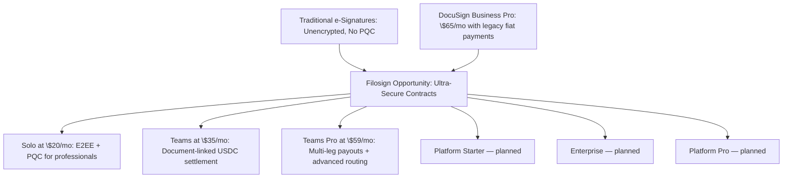

# Filosign Competitive Pricing Analysis & Strategy

> **Source of truth (shipped):** [`packages/entitlements/src/catalog/v1.ts`](../../packages/entitlements/src/catalog/v1.ts) · marketing prices: [`apps/astro/src/pages/pricing.astro`](../../apps/astro/src/pages/pricing.astro). Plan IDs: `free`, `individual` (Solo), `teams`, `teams_pro`, `enterprise`. **Future (not in catalog v1):** Platform Starter, Platform Pro, Secure Enterprise — planned separately.

## Filosign catalog v1 (current)

| Plan | Monthly | Yearly (per month) | Docs / month | Recipients | Settlement | Routing advanced |
|------|---------|-------------------|--------------|------------|--------------|-------------------|
| **Free** | $0 | — | 3 (account) | 1 | — | — |
| **Solo** (`individual`) | $20 | $15 | 10 (account) | 3 | — | — |
| **Teams** | $35/user | $29/user | 15/seat (pooled) | 10 | USDC basic (`settlement.basic`) | — |
| **Teams Pro** | $59/user | $49/user | 25/seat (pooled) | 15 | basic + multi-leg/update/cancel (`settlement.advanced`) | sequential/parallel routing, quorum |
| **Enterprise** | Custom | Custom | Unlimited | Unlimited | advanced | advanced |

---

## 1. Market Comparison Table

The table below outlines the current pricing, limits, and primary value propositions of the leading platforms alongside Filosign's premium tiers.

| Provider | Subscription Tier | Monthly Rate | Billed Annually (Monthly Equiv.) | Document / Envelope Limit | Payment Feature Integration | Target Audience & Core Value Proposition |
| :--- | :--- | :---: | :---: | :---: | :---: | :--- |
| **DocuSign** | **Personal**   **Standard**   **Business Pro**   **Enterprise** | \$15.00 / mo   \$45.00 / user/mo   \$65.00 / user/mo   Custom | \$10.00 / mo   \$25.00 / user/mo   \$40.00 / user/mo   Custom | 5 / month   100 / user/year   100 / user/year   Custom | No   No   **Yes** (Stripe/Paypal)   **Yes** | **The Premium Standard:**   Trusted enterprise brand, deep CRM integrations, but highly restrictive caps on envelopes. Payments are locked behind the expensive Business Pro tier (\$65/mo monthly, \$40/mo annually). Lacks cryptographic security (E2EE/PQC). |
| **Documenso** | **Free**   **Individual**   **Teams**   **Platform** | \$0.00   \$30.00 / mo   \$40.00 / mo   \$250.00 / mo | \$0.00   N/A   N/A   N/A | 5 / month   Unlimited   Unlimited   Unlimited | No   No   No   No | **Open-Source & Developer-First:**   Allows self-hosting. SaaS provides unlimited documents on paid plans. Lacks built-in payment features and post-quantum encryption. |
| **DocuSeal** | **Free**   **Pro** | \$0.00   \$20.00 / user/mo | \$0.00   \$15.00 / user/mo | 10 requests/mo   Unlimited | No   No | **Simple SaaS & Self-Hosted:**   Clean UI, unlimited documents/templates. Focuses on straightforward UX but no native payments or cryptographic E2EE. |
| **OpenSign** | **Free**   **Professional**   **Teams**   **Enterprise** | \$0.00   \$29.99 / mo   \$39.99 / user/mo   Custom | \$0.00   \$15.00 / mo   \$20.00 / user/mo   Custom | Unlimited (Self-sign)   Unlimited   Unlimited   Unlimited | No   No   No   No | **Document-Heavy Alternative:**   Generous free tier for self-signing. Professional adds webhooks; Teams adds shared templates. No native payment workflows. |
| **Filosign** *(catalog v1)* | **Free** · **Solo** · **Teams** · **Teams Pro** · *(future: Enterprise, Platform Starter, Platform Pro)* | **\$0** · **\$20** / mo · **\$35** / user/mo · **\$59** / user/mo · Custom · TBD · TBD | **\$0** · **\$15** / mo · **\$29** / user/mo · **\$49** / user/mo · Custom · TBD · TBD | 3 lifetime · 10 / mo · 15 / seat · 25 / seat · Custom · TBD · TBD | No · No · **Yes** (USDC basic) · **Yes** (advanced splits + rule CRUD) · TBD · TBD · TBD | **E2EE + PQC signing;** Teams+ attached USDC payouts; Teams Pro advanced routing and settlement. See catalog v1 table above. |

---

## 2. Competitor Value Analysis & Filosign's USP

Traditional e-signature products treat documents as plain text on their servers, leaving them vulnerable to data breaches. Furthermore, none of them protect against the upcoming threat of quantum decryption. Filosign addresses these issues by offering a robust security model alongside modern Web3 payment mechanics.

### Filosign's Core Value Propositions (USPs)
1. **End-to-End Encryption (E2EE):** Documents are encrypted client-side. Filosign's servers only host encrypted blobs (IPFS/S3), meaning we cannot read the contents of your contracts.
2. **Post-Quantum Cryptography (PQC):** We use state-of-the-art lattice-based cryptography (Dilithium/ML-DSA) for signatures, ensuring documents signed today remain secure even when quantum computers become available.
3. **Automated Blockchain Settlements:** We integrate stablecoin payouts directly into the signing flow. When all parties sign, `FSPaymentValidator` releases USDC via permissionless `executePayout` (server relay after sign, with manual wallet fallback).

---

## 3. Derivation of Filosign's Pricing Strategy

Filosign's pricing strategy rejects the "race to the bottom" model. Because we protect high-value, highly sensitive agreements, a low price point would undermine trust. Instead, we position Filosign as a premium product that is more secure than DocuSign but priced competitively.

### Tier-by-Tier Strategic Justification

#### 1. Free
* **Price:** \$0.00
* **Offering:** 3 documents lifetime, 1 recipient, E2EE + PQC. No settlement.
* **Strategic Role:** Entry tier; upgrade path to Solo for volume and proof exports.

#### 2. Solo (`individual`)
* **Price:** \$20.00 / month (Monthly) or **\$15.00 / month (Billed Annually)**
* **Offering:** 10 documents/mo, up to 3 recipients. E2EE, PQC, draft review links, extended archival options.
* **Strategic Positioning:** Premium security below DocuSign Personal monthly; annual undercuts legacy \$15/\$10 positioning with higher list monthly.

#### 3. Teams
* **Price:** \$35.00 / user / month (Monthly) or **\$29.00 / user / month (Billed Annually)**
* **Offering:** 15 documents/user/mo pooled, 10 recipients, shared templates/drafts, **`features.settlement.basic`** (single-leg USDC rules at send or attach).
* **Strategic Positioning:** Team collaboration + non-custodial payouts without Teams Pro routing/advanced settlement.

#### 4. Teams Pro
* **Price:** \$59.00 / user / month (Monthly) or **\$49.00 / user / month (Billed Annually)**
* **Offering:** 25 documents/user/mo pooled, 15 recipients, **`features.settlement.advanced`** (multi-leg, update/cancel), **`features.routing.advanced`**, bulk send, webhooks, branding, etc. (see catalog v1).
* **Strategic Positioning:** Operational control tier vs DocuSign Business Pro — E2EE, PQC, on-chain routing, and settlement CRUD.

#### 5–7. Future tiers (not in catalog v1)

Platform Starter, Secure Enterprise, and Platform Pro remain **planned** (API/embedded/developer). Pricing TBD; do not expose in product until catalog entries exist.

> [!NOTE]
> **Developer Platform API & SDK Roadmap Footnote:** The Developer Platform API (Starter/Pro) and the client JS SDK are planned roadmap items. The core platform API capabilities must be built and integrated before we can actively charge developer subscribers.
