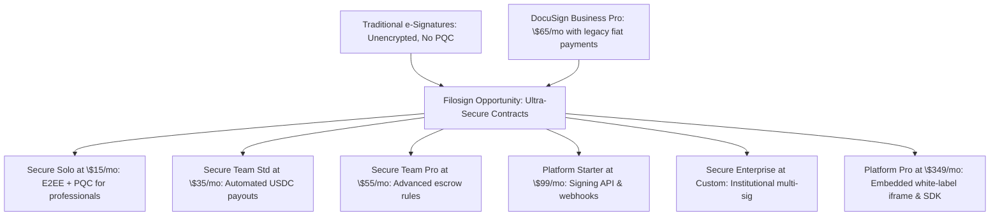

# Filosign Competitive Pricing Analysis & Strategy

This document provides a comprehensive market pricing analysis comparing **DocuSign** (the premium market leader) with three prominent open-source/developer-friendly alternatives (**Documenso**, **DocuSeal**, and **OpenSign**). Based on this competitive landscape, we derive and justify the premium five-tier subscription pricing model for **Filosign**.

---

## 1. Market Comparison Table

The table below outlines the current pricing, limits, and primary value propositions of the leading platforms alongside Filosign's premium tiers.

| Provider | Subscription Tier | Monthly Rate | Billed Annually (Monthly Equiv.) | Document / Envelope Limit | Payment Feature Integration | Target Audience & Core Value Proposition |
| :--- | :--- | :---: | :---: | :---: | :---: | :--- |
| **DocuSign** | **Personal**   **Standard**   **Business Pro**   **Enterprise** | \$15.00 / mo   \$45.00 / user/mo   \$65.00 / user/mo   Custom | \$10.00 / mo   \$25.00 / user/mo   \$40.00 / user/mo   Custom | 5 / month   100 / user/year   100 / user/year   Custom | No   No   **Yes** (Stripe/Paypal)   **Yes** | **The Premium Standard:**   Trusted enterprise brand, deep CRM integrations, but highly restrictive caps on envelopes. Payments are locked behind the expensive Business Pro tier (\$65/mo monthly, \$40/mo annually). Lacks cryptographic security (E2EE/PQC). |
| **Documenso** | **Free**   **Individual**   **Teams**   **Platform** | \$0.00   \$30.00 / mo   \$40.00 / mo   \$250.00 / mo | \$0.00   N/A   N/A   N/A | 5 / month   Unlimited   Unlimited   Unlimited | No   No   No   No | **Open-Source & Developer-First:**   Allows self-hosting. SaaS provides unlimited documents on paid plans. Lacks built-in payment features and post-quantum encryption. |
| **DocuSeal** | **Free**   **Pro** | \$0.00   \$20.00 / user/mo | \$0.00   \$15.00 / user/mo | 10 requests/mo   Unlimited | No   No | **Simple SaaS & Self-Hosted:**   Clean UI, unlimited documents/templates. Focuses on straightforward UX but no native payments or cryptographic E2EE. |
| **OpenSign** | **Free**   **Professional**   **Teams**   **Enterprise** | \$0.00   \$29.99 / mo   \$39.99 / user/mo   Custom | \$0.00   \$15.00 / mo   \$20.00 / user/mo   Custom | Unlimited (Self-sign)   Unlimited   Unlimited   Unlimited | No   No   No   No | **Document-Heavy Alternative:**   Generous free tier for self-signing. Professional adds webhooks; Teams adds shared templates. No native payment workflows. |
| **Filosign**   *(Proposed)* | **Free Trial**   **Secure Solo**   **Secure Team Std**   **Secure Team Pro**   **Platform Starter**   **Secure Enterprise**   **Platform Pro** | **\$0.00**   **\$15.00** / mo   **\$35.00** / user/mo   **\$55.00** / user/mo   **\$99.00** / mo   **Custom** *(\$125 modeled)*   **\$349.00** / mo | **\$0.00**   **\$9.00** / mo   **\$25.00** / user/mo   **\$40.00** / user/mo   **\$79.00** / mo   **Custom** *(\$99 modeled)*   **\$299.00** / mo | 3 lifetime (Invite-only, 1 recipient)   10 / month (3 recipients avg.)   30 / month (3 recipients avg.)   30 / month (3 recipients avg.)   100 / month (API)   100 / month (3 recipients avg.)   500 / month (Embedded) | No   No   **Yes** (USDC Escrows & Settlements)   **Yes** (Custom Escrows & Multi-chain)   **Yes** (API Webhooks/PQC Signing)   **Yes** (Multi-sig & Integrations)   **Yes** (Embedded Sign & JS SDK) | **Ultra-Premium Secure e-Signing:**   The only platform offering end-to-end encryption (E2EE), post-quantum secure (PQC) cryptographic signatures, and non-custodial blockchain stablecoin settlements. |

---

## 2. Competitor Value Analysis & Filosign's USP

Traditional e-signature products treat documents as plain text on their servers, leaving them vulnerable to data breaches. Furthermore, none of them protect against the upcoming threat of quantum decryption. Filosign addresses these issues by offering a robust security model alongside modern Web3 payment mechanics.

### Filosign's Core Value Propositions (USPs)
1. **End-to-End Encryption (E2EE):** Documents are encrypted client-side. Filosign's servers only host encrypted blobs (IPFS/S3), meaning we cannot read the contents of your contracts.
2. **Post-Quantum Cryptography (PQC):** We use state-of-the-art lattice-based cryptography (Dilithium/ML-DSA) for signatures, ensuring documents signed today remain secure even when quantum computers become available.
3. **Automated Blockchain Settlements:** We integrate stablecoin payouts directly into the signing flow. When all parties sign, smart contracts (running via Gelato network automation) execute non-custodial payouts instantly.

---

## 3. Derivation of Filosign's Pricing Strategy

Filosign's pricing strategy rejects the "race to the bottom" model. Because we protect high-value, highly sensitive agreements, a low price point would undermine trust. Instead, we position Filosign as a premium product that is more secure than DocuSign but priced competitively.

### Tier-by-Tier Strategic Justification

#### 1. Free Trial
* **Price:** \$0.00 (Lifetime limit)
* **Offering:** 3 documents lifetime, maximum of 1 recipient per document. E2EE and PQC signatures enabled by default. Mainnet payment features are disabled.
* **Strategic Role:** Acts as a sandbox environment gated by invite-only access to control operational cost exposure. By locking the real-money integrations (mainnet payouts) behind the paid tiers, we prevent abuse while allowing users to fully test the interface.

#### 2. Secure Solo
* **Price:** \$15.00 / month (Monthly) or **\$9.00 / month (Billed Annually)**
* **Offering:** 10 documents/mo, average of 3 recipients per document. E2EE and PQC signatures fully enabled.
* **Strategic Positioning:**
  * **vs. DocuSign Personal (\$15/mo Monthly / \$10/mo Annual):** Matches DocuSign's monthly price (\$15/mo) exactly and beats its annual rate (\$9/mo vs. \$10/mo), while offering **2x the document volume** (10 vs. 5) and absolute privacy via client-side E2EE and quantum-resistant signatures. It delivers premium security at a lower annual entry point.
  * **vs. Documenso Individual (\$30/mo) / OpenSign Professional (\$29.99/mo Monthly / \$15/mo Annual):** Exceptionally competitive, offering premium security features (PQC) at a significantly lower cost than their solo plans.

#### 3. Secure Team Standard
* **Price:** \$35.00 / user / month (Monthly) or **\$25.00 / user / month (Billed Annually)**
* **Offering:** 30 documents/user/mo, average of 3 recipients per document. Includes all security features plus automated blockchain payment settlements and shared team template libraries.
* **Strategic Positioning:**
  * **vs. DocuSign Standard (\$45/mo Monthly / \$25/mo Annual):** Matches DocuSign's annual Standard price *exactly* (\$25/user/mo), eliminating friction. However, standard DocuSign doesn't support payment collection at all, whereas Filosign includes on-chain USDC escrows and payment rules natively at this price point.

#### 4. Secure Team Pro
* **Price:** \$55.00 / user / month (Monthly) or **\$40.00 / user / month (Billed Annually)**
* **Offering:** 30 documents/user/mo. Includes all Team Standard features plus advanced smart contract payout rules (conditional escrows, multi-chain releases) and detailed team permissions.
* **Strategic Positioning:**
  * **vs. DocuSign Business Pro (\$65/mo Monthly / \$40/mo Annual):** Matches DocuSign's annual Business Pro rate *exactly* (\$40/user/mo). While DocuSign Business Pro only supports simple Stripe credit card payments, Filosign Team Pro offers E2EE, PQC, and custom smart contract escrows.

#### 5. Platform Starter (API)
* **Price:** \$99.00 / month (Monthly) or **\$79.00 / month (Billed Annually)**
* **Offering:** 100 documents/mo. Includes access to E2EE and PQC signing APIs, webhooks, and developer dashboard.
* **Strategic Positioning:**
  * **vs. DocuSign API Starter (\$50/mo for 40 env/mo) & Intermediate (\$300/mo for 100 env/mo):** Filosign is exceptionally competitive. At \$79/mo (annual), we offer 100 documents/mo, which is more than double DocuSign's Starter volume and matches their \$300/mo Intermediate volume for a fraction of the cost, all while delivering end-to-end encrypted contract security and quantum resistance.
  * **vs. Documenso Platform (\$250/mo):** Provides a much lower entry barrier (\$79/mo vs. \$250/mo) for developers who only need standard API signing and webhooks without paying for enterprise-grade custom integrations immediately.

#### 6. Secure Enterprise (Marketed as Custom / Contact Us)
* **Price:** Custom Pricing (modeled internally at \$125.00 / user / month monthly, or **\$99.00 / user / month billed annually** with a base annual contract commitment starting at \$5,000.00/yr)
* **Offering:** 100 documents/user/mo. Includes multi-sig approval workflows, priority RPC relays, and custom branding integrations.
* **Strategic Positioning:**
  * Target audience: VC firms, OTC trading desks, and protocols moving large amounts of funds.
  * Stating "Contact Us / Custom" on the website helps establish credibility, while knowing our internal baseline is \$99/user/mo annually allows us to maintain a strong margin anchor when clients request custom agreements.

#### 7. Platform Pro (Embedded)
* **Price:** \$349.00 / month (Monthly) or **\$299.00 / month (Billed Annually)**
* **Offering:** 500 documents/mo. Adds full white-labeled embedded signing iframe, Javascript SDK, priority RPC relays, and dedicated Slack/Telegram developer support channels.
* **Strategic Positioning:**
  * **vs. DocuSign API Intermediate/Advanced (\$300/mo / \$480/mo for 100 env/mo):** DocuSign charges \$480/mo for only 100 envelopes. Filosign Platform Pro offers **5x the volume** (500 docs/mo) and full white-labeled embedded signing flows with priority infrastructure for \$299/mo (annual), saving developers thousands of dollars annually while providing a far more advanced cryptographic architecture.
  * **vs. Documenso Platform (\$250/mo):** While Documenso offers unlimited documents, it lacks native post-quantum cryptography, client-side E2EE, and built-in non-custodial smart-contract escrow payouts. For only \$49/mo more (billed annually), developers gain a secure, turn-key Web3-integrated signature suite.

> [!NOTE]
> **Developer Platform API & SDK Roadmap Footnote:** The Developer Platform API (Starter/Pro) and the client JS SDK are planned roadmap items. The core platform API capabilities must be built and integrated before we can actively charge developer subscribers.
