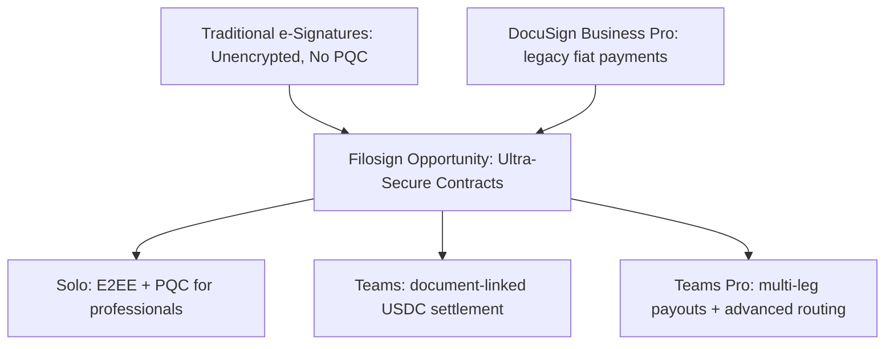

# Filosign pricing and packaging

> **Source of truth (shipped):** [`packages/entitlements/src/catalog/v1.ts`](../../packages/entitlements/src/catalog/v1.ts) · marketing prices: [`apps/astro/src/pages/pricing.astro`](../../apps/astro/src/pages/pricing.astro). Plan IDs: `free`, `individual` (Solo), `teams`, `teams_pro`, `enterprise`. **Future (not in catalog v1):** Platform Starter, Platform Pro, Secure Enterprise.

**Engineering roadmap (suggested features):** [`feature_effort_ranking.md`](feature_effort_ranking.md) — not duplicated here.

## Catalog v1 (current)

| Plan | Monthly | Yearly (per month) | Docs / month | Recipients | Settlement | Routing advanced |
|------|---------|-------------------|--------------|------------|--------------|-------------------|
| **Free** | $0 | - | 3 (account) | 1 | - | - |
| **Solo** (`individual`) | $20 | $15 | 10 (account) | 3 | USDC basic (`settlement.basic`) | - |
| **Teams** | $35/user | $29/user | 15/seat (pooled) | 10 | USDC basic (`settlement.basic`) | - |
| **Teams Pro** | $59/user | $49/user | 25/seat (pooled) | 15 | basic + multi-leg/update/cancel (`settlement.advanced`) | sequential/parallel routing, quorum |
| **Enterprise** | Custom | Custom | Unlimited | Unlimited | advanced | advanced |

**Settlement gates:** `settlement.basic` / `advanced` in catalog; workspace orgs still require manual payout feature approval — see [`../settlements/payout-feature-approval-checklist.md`](../settlements/payout-feature-approval-checklist.md).

## Request Access (Free trial)

- No signup without invite code on Astro landing.
- Work-email domains → auto invite; public domains → manual review queue + superadmin tools.
- Waitlist fields: social handle, use case, attribution source.

## Market comparison (summary)

| Provider | Entry paid | Doc limits | Native payments | E2EE / PQC |
| :--- | :---: | :---: | :---: | :---: |
| DocuSign Personal → Business Pro | $15–65/mo | 5/mo – 100/user/yr | Business Pro+ (Stripe) | No |
| Documenso Individual / Teams | $30–40/mo | Unlimited (paid) | No | No |
| DocuSeal Pro | $20/user/mo | Unlimited | No | No |
| OpenSign Pro / Teams | $30–40/user/mo | Unlimited | No | No |
| **Filosign Solo / Teams / Teams Pro** | **$20 / $35 / $59** | **10 / 15 / 25 per seat** | **USDC on Teams+** | **Yes** |

## Core value propositions

1. **E2EE:** Documents encrypted client-side; servers store ciphertext only.
2. **PQC:** Dilithium/ML-DSA signatures for long-term integrity claims.
3. **Non-custodial USDC settlement:** `FSPaymentValidator` pull payouts when signing conditions are met; Filosign never custodies funds.

## Pricing strategy (positioning)

Premium security vs legacy e-sign; settlement as wedge for Web3-native teams. Solo undercuts DocuSign Personal on annual; Teams adds collaboration + basic payouts; Teams Pro adds advanced routing and settlement CRUD.

### Tier roles

- **Free:** 3 lifetime docs; upgrade path to Solo.
- **Solo:** Independent professionals; `settlement.basic` in catalog (workspace + approval gates apply).
- **Teams:** Pooled docs, shared templates/drafts, `settlement.basic`.
- **Teams Pro:** `settlement.advanced`, `routing.advanced`, bulk send, webhooks, branding (catalog flags; some UI not built — see `feature_effort_ranking.md`).
- **Enterprise / Platform tiers:** Planned; not in catalog v1.

## Catalog-only flags (Teams Pro / Enterprise, not fully built)

`features.integrations.custom`, `features.quota_allocation`, `features.bulk_send`, `features.template_folders`, `features.branding.custom`, `features.webhooks`, `features.metadata.tags` — enabled in catalog but no `assertEntitlement` paths yet. See [`feature_effort_ranking.md`](feature_effort_ranking.md).
