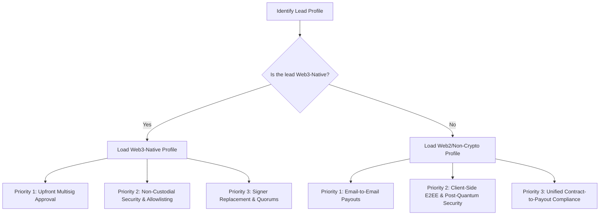

# Filosign Wedges & Product Selling Points
 
This document serves as the single source of truth for the product capabilities, sales wedges, and messaging strategies for both human sales reps and AI agents. It details how the technical implementation translates directly into buyer benefits.
 
---
 
## 1. Target Persona Scoping Filter (AI Agent Decision Tree)
 
Before drafting any outreach or responding to a prospect, AI agents must classify the lead and load the corresponding messaging profile:
 

 
---
 
## 2. Web3-Native Target Profile
 
**Target Audience:** Web3 Foundations (Grants Leads), active DAOs (Treasury Leads), and funded Web3 Startups.
*   **What they understand:** Gnosis Safe, USDC, gas fees, smart contracts, multisig approvals.
*   **What they care about:** Saving time on manual multisig coordination, audit readiness, and security of treasury assets.
 
### Priority 1: High-Impact Outcome Wedges
1.  **Upfront Multisig Approval (The Ultimate Time Saver)**
    *   *The Pitch:* Your multisig signers sign the approval rule once at the beginning of the month when you send the agreement. Once the recipient signs their milestone, the funds release instantly on-chain. Your signers never have to log back in to approve the release transaction.
    *   *So What? (Outcome):* You never have to spend your Friday afternoon nagging your multisig signers on Telegram to approve transaction hashes.
2.  **Automated Milestone Payouts**
    *   *The Pitch:* Link signed milestone agreements directly to USDC payouts on Base mainnet in a single workflow.
    *   *So What? (Outcome):* Your team doesn't have to manually verify signed PDFs on DocuSign and then type wallet addresses into Gnosis Safe.
 
### Priority 2: Trust & Risk Wedges
1.  **Non-Custodial Security (Zero Custody)**
    *   *The Pitch:* Filosign never touches or custody's your treasury funds. You only pre-approve a token allowance from your Safe. You retain full control and can revoke the authorization on-chain at any time before the recipient signs.
    *   *So What? (Outcome):* Even if Filosign is completely compromised, your treasury remains 100% secure because the funds stay in your own wallet.
2.  **Recipient Allowlisting (Anti-Leakage Control)**
    *   *The Pitch:* Payout destinations are strictly restricted to verified contract participants (signers or viewers). No random external wallet addresses can claim funds.
    *   *So What? (Outcome):* No operations staff or malicious actors can accidentally or intentionally route company funds to an unapproved external wallet.
3.  **EIP-7702 Gasless Smart Accounts (Gas Sponsorship)**
    *   *The Pitch:* We use the latest EIP-7702 execution standard on Base mainnet. This allows our embedded email wallets to function as smart accounts under the hood, enabling us to sponsor 100% of the transaction and approval gas fees.
    *   *So What? (Outcome):* Senders and signers get a completely gasless experience on mainnet without the friction of smart account setup.
 
### Priority 3: Operational Wedges
1.  **On-Chain Signer Replacement**
    *   *The Pitch:* If a contributor goes MIA or leaves a project mid-agreement, you can propose and execute a signer swap on-chain.
    *   *So What? (Outcome):* If a developer leaves mid-agreement, you just swap their address on-chain. You don't have to throw away the contract and start over.
2.  **Advanced Routing & Quorums**
    *   *The Pitch:* Support for sequential, parallel, or quorum-based signing (e.g. any 2 of 3 board members must sign).
    *   *So What? (Outcome):* You can set up "any 2 of 3 managers must sign" to match your actual corporate board approval rules.
 
---
 
## 3. Web2 / Non-Crypto Target Profile
 
**Target Audience:** Traditional startups, remote agencies, global outsourcing companies, and Web2 platforms hiring global talent.
*   **What they understand:** Email, DocuSign, Stripe, invoice compliance, PDF files, wire transfers.
*   **What they do NOT care about:** Blockchain, gas, private keys, smart contracts, Web3 jargon.
*   **Important Directive:** Never use crypto terms in this profile. Translate all Web3 elements into Web2 equivalents.
 
### Priority 1: High-Impact Outcome Wedges
1.  **Email-to-Email Payouts (Zero-Friction Global Payments)**
    *   *The Pitch:* Send global payouts directly to a recipient's email address in stable digital dollars (USDC). The recipient simply signs up with their email to receive their funds.
    *   *So What? (Outcome):* You can pay global contractors instantly using digital dollars without forcing them to set up MetaMask or pay gas.
2.  **Unified Document-to-Payment Compliance**
    *   *The Pitch:* Combine contract signing, tax form collection (W-8/W-9), and payment approval into a single automated workflow.
    *   *So What? (Outcome):* You don't have to spend your weekend matching signed PDFs with bank wire receipts and invoices.
 
### Priority 2: Trust & Risk Wedges
1.  **Client-Side End-to-End Encryption**
    *   *The Pitch:* All documents are encrypted directly in the browser before being uploaded. Filosign servers only store encrypted files and cannot read your agreements.
    *   *So What? (Outcome):* Nobody outside your organization (including Filosign) can ever read your sensitive business agreements.
2.  **Future-Proof Signature Security (Post-Quantum)**
    *   *The Pitch:* Agreements are sealed using advanced cryptographic signatures that are secured against future quantum computing decryption attacks.
    *   *So What? (Outcome):* Your 10-year contracts will remain legally binding even when quantum computers are invented and break legacy DocuSign signatures.
3.  **Human-Friendly Secure Sharing (Cold Invite)**
    *   *The Pitch:* You can invite unregistered external recipients to sign or view documents securely using a simple 6-word passcode. Filosign wraps the file key using Argon2id key derivation, maintaining zero-trust end-to-end encryption.
    *   *So What? (Outcome):* You can share highly secure, encrypted contracts with Web2 clients using a simple 6-word passcode.
 
### Priority 3: Operational Wedges
1.  **Built-In Operational Vault (Fiat On-Ramp)**
    *   *The Pitch:* Every account comes with a built-in payout account that you can fund directly using a credit card or bank transfer.
    *   *So What? (Outcome):* You can fund and test your entire onboarding-to-payout pipeline using a credit card on Day 1.
2.  **Signer Swap Capability**
    *   *The Pitch:* Swap out signers on an active agreement if the designated recipient is unavailable, without having to cancel the deal.
    *   *So What? (Outcome):* A counterparty being out of office won't stall your sales pipeline; you can swap the signer instantly.
